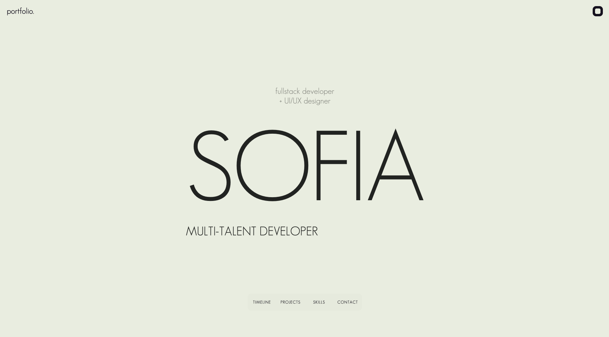

# Portfolio V2

This project is my second iteration of my personal portfolio, built with ReactJS, GSAP and freamer-motion.

## Table of Contents
- [Overview](#overview)
- [Features](#features)
- [Preview](#preview)
- [Link](#link)

## Overview

Welcome to my personnal portfolio, an enhanced representation of my personal journey and work. This portfolio showcases my skills, projects, and experiences in an engaging and interactive way. It serves as a window to my creative world, inviting you to explore the work I'm passionate about.

## Preview

## Link

Explore my portfolio by visiting the live site:

[Portfolio Version 2](https://sofia-hechaichi.com/)

Feel free to check out my work and get in touch if you have any inquiries or feedback. Thank you for your interest!

